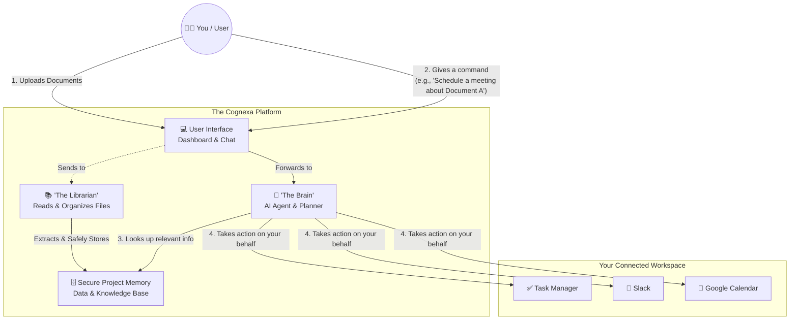
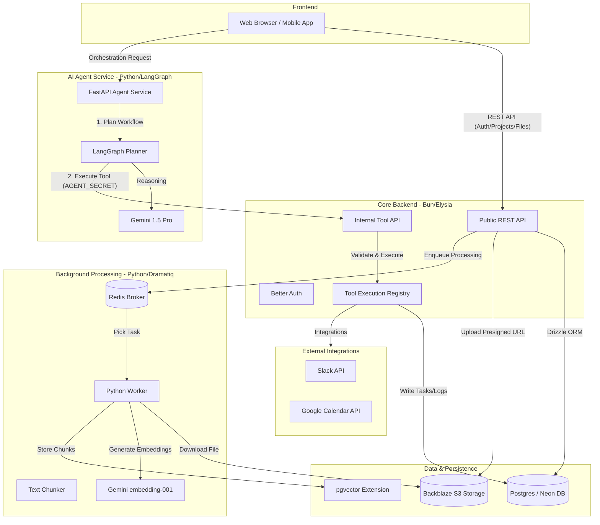

# Cognexa
An AI-powered workflow orchestration platform designed for students, researchers, and early professionals. It transforms scattered tasks, documents, meetings, and conversations into an intelligent, connected workspace that reduces administrative overload and increases time for deep, meaningful work.
# Features
### Core Features:
- Task creation, updating, and deletion
- AI-powered document upload and embedding
- Semantic document search
- Conversational chatbot with task awareness
- Task extraction from uploaded documents
### Upcoming / Scalable Features:
- Google Calendar integration
- Slack notification integration
- Role-based automation execution
- Background file processing with Redis queue
- Action logging and execution tracking
- Workflow pattern detection
- Meeting bot with summarization
- Research citation assistance
- Role based Multi-user team knowledge hubs

> [!NOTE]
> Not all the features are still hosted for lack of fund.

# How it works

# Development
### Tech Stack
- [Backend](https://github.com/Nexylor-Tech/cognexa-backend) 
- [Frontend](https://github.com/Nexylor-Tech/cognexa-frontend)
- [Worker](https://github.com/Nexylor-Tech/worker)
- [MCP Agent](https://github.com/Nexylor-Tech/cognexa-agent)
- [MeetingBot](https://github.com/Nexylor-Tech/meetingbot) (Under development)

Backend Workflow 

